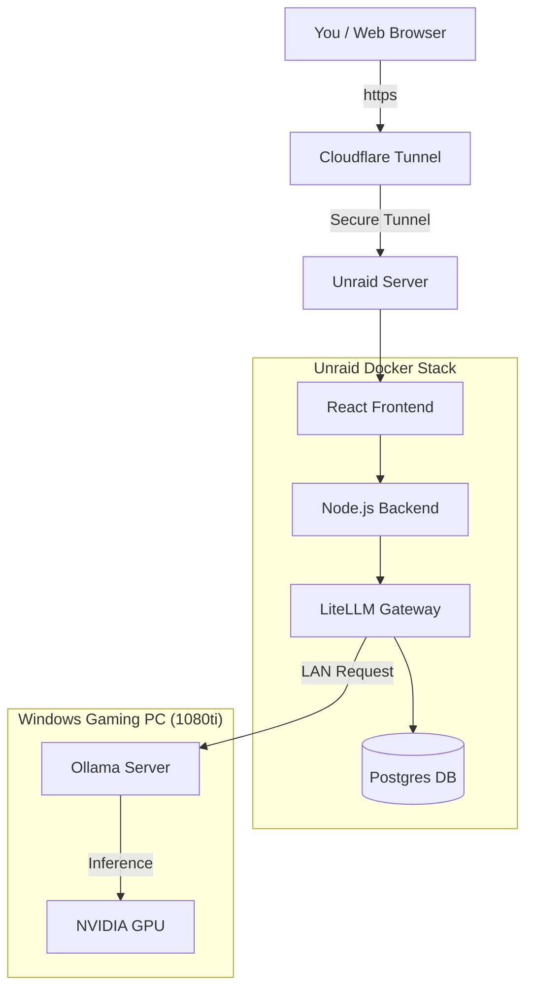

# 🏠 Locally Hosted AI Gateway (OpenRouter Mirror)

A secure, private, and locally hosted AI Gateway that mirrors OpenRouter functionality on your own hardware. It bridges your local Unraid server, Windows GPU machine, and Cloudflare for secure remote access.

## 🚀 Key Advantages

- **100% Data Control**: Your chats and data stay on your local network (Unraid & Windows).
- **Zero Latency**: Direct LAN connection between your API and your GPU.
- **Hybrid Power**: Use local Ollama models for free inference, fallback to Cloud (OpenAI/Anthropic) only when needed.
- **No Monthly Fees**: Self-hosted alternative to SaaS gateways.

## 🏗️ System Architecture

This system is designed to run on **Unraid** but connects to a powerful **Windows PC** for inference.



## 🛠️ Components

### 1. The Brain (Windows PC)
*   **Software**: Ollama (Windows Version)
*   **Hardware**: NVIDIA 1080ti (11GB VRAM)
*   **Role**: Runs the heavy AI models (Llama 3, Mistral, Dolphin) locally.

### 2. The Body (Unraid Server)
*   **Software**: Docker, LiteLLM, Web Application
*   **Role**: Hosts the interface, manages users, and routes traffic.
*   **Integration**: Connects to Windows via local IP (e.g., `192.168.1.50`).

### 3. The Door (Cloudflare)
*   **Software**: Cloudflared Container
*   **Role**: Provides secure `https` access from anywhere without opening router ports.

## 📦 Quick Start (Unraid)

1.  **Clone this repo** to your Unraid AppData:
    ```bash
    git clone https://github.com/sleehoco/ai-gateway.git /mnt/user/appdata/ai-gateway
    ```

2.  **Configure Environment**:
    ```bash
    cp .env.example .env
    nano .env
    ```
    *   Set `OLLAMA_API_BASE` to your Windows PC's IP address.
    *   Set `CLOUDFLARE_TUNNEL_TOKEN` from your Cloudflare Dashboard.

3.  **Launch**:
    ```bash
    docker-compose up -d --build
    ```

4.  **Access**:
    *   **Local**: `http://<UNRAID_IP>:3002`
    *   **Remote**: `https://ai.yourdomain.com`

## 🤖 Supported Models

### Uncensored / Local (Free)
*   `local/dolphin` (Dolphin Mistral - Uncensored)
*   `local/llama3.2` (Meta Llama 3.2 - Fast)
*   `local/mistral` (Mistral 7B - Balanced)

### Cloud Fallback (Optional)
*   `gpt-4o` (OpenAI)
*   `claude-3-5-sonnet` (Anthropic)
*   `groq/llama3` (Groq - Super Fast)

## 🔐 Security Features
*   **Local-First**: All model routing happens inside your LAN.
*   **Authentication**: Multi-user login system protected by JWT.
*   **Tunneling**: No open ports on your router firewall.
